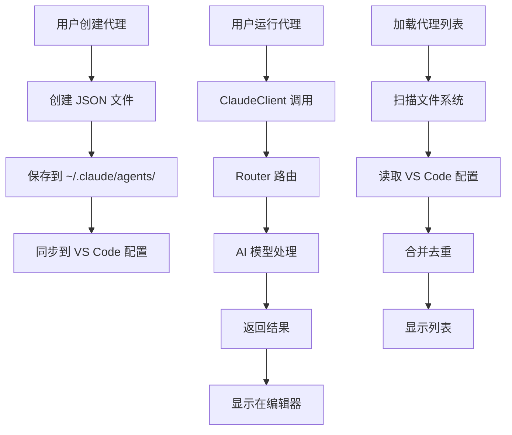

# Claude 代理管理系统架构

## 📋 概述

Chameleon 的代理管理系统现在采用**双重存储机制**，既兼容 Claude Code 原生格式，又提供 VS Code 扩展的便利性。

## 🏗️ 架构设计

### 存储机制

#### 1. **文件系统存储** (主要)
- **位置**: `~/.claude/agents/`
- **格式**: JSON 文件 (`.json`)
- **命名**: `{agent_name}.json`
- **兼容性**: 完全兼容 Claude Code 原生代理系统

#### 2. **VS Code 配置存储** (备份)
- **位置**: VS Code 全局设置 `chameleon.subAgents`
- **用途**: 提供扩展特定的元数据和快速访问
- **同步**: 与文件系统保持同步

### 代理文件格式

```json
{
  "name": "代理名称",
  "description": "代理描述",
  "system_prompt": "代理的系统提示词",
  "default_task": "默认任务描述",
  "model": "sonnet",
  "enable_file_read": true,
  "enable_file_write": true,
  "enable_network": false,
  "hooks": null,
  "created_at": "2025-01-23T10:00:00.000Z",
  "updated_at": "2025-01-23T10:00:00.000Z"
}
```

## 🔧 核心功能

### 1. **代理创建**
- 在 `~/.claude/agents/` 创建 JSON 文件
- 同时保存到 VS Code 配置作为元数据
- 文件名使用安全的格式 (小写、下划线分隔)

### 2. **代理加载**
- **文件系统优先**: 首先扫描 `~/.claude/agents/` 目录
- **配置合并**: 合并 VS Code 配置中的代理
- **去重处理**: 按名称去重，避免重复显示

### 3. **代理运行**
- **使用 ClaudeClient**: 不再依赖终端命令
- **智能路由**: 通过 Router 系统路由到合适的模型
- **结果展示**: 在编辑器中显示执行结果

## 🚀 运行机制

### 旧方式 (已废弃)
```bash
claude agent run "agent_name"  # ❌ 这个命令不存在
```

### 新方式 (当前实现)
```typescript
// 使用 ClaudeClient 直接调用
const claudeClient = new ClaudeClient({
    defaultModel: 'sonnet',
    timeout: 300000,
    enableRouting: true
});

const response = await claudeClient.sendMessage(
    agentPrompt,
    'sonnet',
    {
        projectPath: workspacePath,
        sessionId: `agent_${agentId}_${timestamp}`
    }
);
```

## 📁 文件结构

```
~/.claude/
├── agents/                    # Claude Code 代理存储目录
│   ├── code_reviewer.json     # 代码审查代理
│   ├── bug_fixer.json         # 错误修复代理
│   └── documentation.json     # 文档生成代理
├── projects/                  # Claude Code 项目目录
└── config.json               # Claude Code 配置文件
```

## 🔄 数据流



## 🎯 优势

### 1. **兼容性**
- 完全兼容 Claude Code 原生代理系统
- 可以导入/导出 `.json` 代理文件
- 支持与其他 Claude Code 工具集成

### 2. **性能**
- 使用 ClaudeClient 直接调用，避免终端开销
- 智能路由系统，自动选择最优模型
- 流式响应，实时显示结果

### 3. **用户体验**
- 在编辑器中直接查看结果
- 支持 Markdown 格式输出
- 完整的错误处理和用户反馈

## 🔧 配置选项

### VS Code 设置
```json
{
  "chameleon.subAgents": [
    {
      "id": "unique_id",
      "name": "代理名称",
      "description": "代理描述",
      "prompt": "系统提示词",
      "status": "active",
      "createdAt": "2025-01-23T10:00:00.000Z",
      "lastUsed": "2025-01-23T10:00:00.000Z",
      "filePath": "~/.claude/agents/agent_name.json"
    }
  ]
}
```

## 🚨 注意事项

1. **文件权限**: 确保 VS Code 有权限访问 `~/.claude/` 目录
2. **命名规范**: 代理名称会自动转换为安全的文件名
3. **备份建议**: 定期备份 `~/.claude/agents/` 目录
4. **版本兼容**: 代理文件格式与 Claude Code 版本兼容

## 🔮 未来改进

1. **代理模板**: 提供常用代理模板
2. **批量操作**: 支持批量导入/导出代理
3. **代理市场**: 集成代理分享功能
4. **性能监控**: 添加代理执行性能统计
