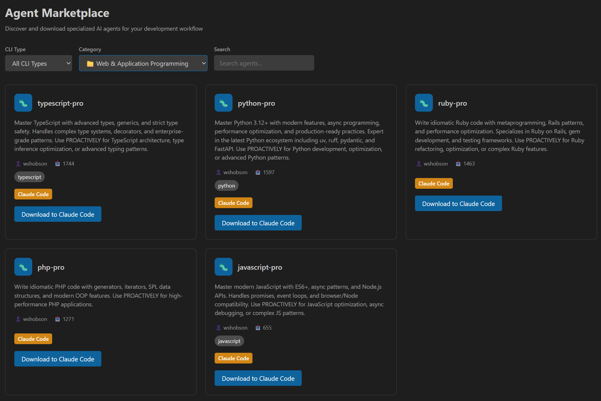

<div align="center">
  <h1>Chameleon AI Assistant</h1>
  <p>
    <strong>Your Open-Source, Universal AI Workstation inside VS Code.</strong>
  </p>
  <p>
    Harness the power of leading AI models, break free from vendor lock-in, and reshape your coding and content creation workflow.
  </p>
  <p>
    <a href="./README.md">English</a> | <a href="./docs/README.es.md">Español</a> | <a href="./docs/README.ja.md">日本語</a> | <a href="./docs/README.de.md">Deutsch</a> | <a href="./docs/README.fr.md">Français</a> | <a href="./docs/README.zh.md">简体中文</a> | <a href="./docs/README.pt.md">Português</a> | <a href="./docs/README.vi.md">Tiếng Việt</a> | <a href="./docs/README.hi.md">हिन्दी</a> | <a href="./docs/README.ko.md">한국어</a> | <a href="./docs/README.ru.md">Русский</a> | <a href="./docs/README.ar.md">العربية</a>
  </p>
</div>

---

## 🦎 What is Chameleon?

Chameleon is more than just another AI chat window. It's a powerful, open-source VS Code extension that transforms your editor into a professional-grade, multi-CLI AI launcher and intelligent agent marketplace.

Designed for developers, writers, and researchers, Chameleon puts you in control with its **Universal Multi-CLI Launcher** that seamlessly integrates **Claude Code** and **Gemini CLI** with extensive third-party AI model support. It features a comprehensive **Agent Marketplace** with hundreds of specialized AI agents, allowing you to connect to any AI provider, manage local and remote models, and build your own private AI toolchain—all within the familiar environment of VS Code.

<div align="center">
  
  <p><em>Universal Multi-CLI Launcher - Navigate between Claude Code and Gemini CLI seamlessly</em></p>
</div>

## ✨ Core Features

### 🚀 Universal Multi-CLI Launcher
* **Claude Code Integration**: Native support for Claude Code CLI with official and third-party AI routing
* **Gemini CLI Support**: Full integration with Gemini CLI including extensive third-party AI model compatibility
* **Unified Interface**: Single dashboard to manage multiple CLI tools and AI providers seamlessly

### 🛒 Agent Marketplace
* **500+ Specialized Agents**: Discover and download from our comprehensive marketplace of AI agents
* **Category-Based Organization**: Architecture, Programming, Infrastructure, Quality & Security, Data & AI, Documentation, and Business agents
* **One-Click Installation**: Download agents directly to Claude Code or Codex with automatic format conversion
* **Community-Driven**: Constantly expanding collection of community-contributed specialized agents

<div align="center">
  
  <p><em>Agent Marketplace - Browse and download 500+ specialized AI agents</em></p>
</div>

#### 🌍 Multi-Language Support
Our Agent Marketplace supports 12 languages with localized interfaces:

<div align="center">
  
  <p><em>Japanese Interface - Complete localization for Japanese developers</em></p>
</div>

<div align="center">
  
  <p><em>Chinese Interface - Native Chinese language support</em></p>
</div>

### 🎯 Advanced AI Engine Support
* **6 AI Engines, 20+ Selected Models**: Break free from vendor lock-in! Support for OpenRouter, DeepSeek, Google, Volcengine, Azure, Ollama and other 6 major AI engines, covering 20+ carefully selected models, including the latest GPT-4o, Claude 3.5 Sonnet, DeepSeek V3, etc.
* **Third-Party Model Integration**: Extensive support for third-party AI models through both Claude Code and Gemini CLI
* **Intelligent Model Routing**: Automatic selection of the best AI model based on task complexity and requirements

### 💼 Professional Development Features
* **Professional Notebook Interface**: Move beyond simple prompts. Structure your AI-driven tasks in a rich notebook format that combines Markdown, code snippets, and AI prompts. Perfect for complex tasks like code reviews, architectural design, and in-depth document analysis.
* **Intelligent Document Processing**: Supercharge your writing and analysis with AI-powered summarization, optimization, and translation.
* **Deep IDE Integration**: Chameleon feels like a native part of VS Code. Access powerful AI tools directly from the context menu, code lenses, and a dedicated sidebar panel.
* **Privacy-First**: Run your AI tasks in a local, secure environment. Chameleon is designed to work with local models and gives you full control over your data.
* **Fully Customizable**: From themes to model routing rules, you can tailor every aspect of Chameleon to fit your exact needs.

## 🚀 Installation Methods

Choose the installation method that best fits your needs:

### 📦 Method 1: VS Code Marketplace (Recommended)

**The easiest way to install Chameleon - perfect for most users.**

1. **Install the Extension:**
   - Open Visual Studio Code
   - Go to Extensions view (`Ctrl+Shift+X` or `Cmd+Shift+X`)
   - Search for **"chameleon-ai-launcher"**
   - Click "Install"

2. **Install Dependencies:**
   - After installation, open Command Palette (`Ctrl+Shift+P` or `Cmd+Shift+P`)
   - Run `Chameleon: Open Installation Guide` command
   - Follow the step-by-step instructions to install Node.js, Git, Claude Code, and Gemini CLI

3. **Configure and Start:**
   - Run `Chameleon: Open AI Settings` to configure your AI providers
   - Click the Chameleon icon in the activity bar to start using!

### 📁 Method 2: Pre-built VSIX Package

**Install directly from the packaged extension file.**

1. **Download VSIX:**
   - Go to [GitHub Releases](https://github.com/chameleon-nexus/Chameleon/releases)
   - Download the latest `chameleon-ai-launcher-x.x.x.vsix` file

2. **Install via VS Code:**
   ```bash
   # Method A: Command line
   code --install-extension chameleon-ai-launcher-x.x.x.vsix
   
   # Method B: VS Code UI
   # 1. Open VS Code
   # 2. Go to Extensions view (Ctrl+Shift+X)
   # 3. Click "..." menu → "Install from VSIX..."
   # 4. Select the downloaded .vsix file
   ```

3. **Complete Setup:**
   - Follow the same dependency installation and configuration steps as Method 1

### 🛠️ Method 3: Build from Source Code

**For developers who want to contribute or customize the extension.**

**Prerequisites:**
- Git
- Node.js (v16 or higher)
- npm or yarn

**Steps:**

1. **Clone and Build:**
   ```bash
   # Clone the repository
   git clone https://github.com/chameleon-nexus/Chameleon.git
   cd Chameleon
   
   # Install dependencies
   npm install
   
   # Compile the extension
   npm run compile
   
   # Package the extension (optional)
   npm install -g @vscode/vsce
   vsce package
   ```

2. **Install for Development:**
   ```bash
   # Method A: Install packaged version
   code --install-extension chameleon-ai-launcher-x.x.x.vsix
   
   # Method B: Run in development mode
   # Open the project in VS Code and press F5 to launch Extension Development Host
   ```

3. **Install Dependencies:**
   - Install Node.js, Git, Claude Code, and Gemini CLI as described in the Installation Guide
   - Configure AI providers through the extension settings

---

## ⚙️ Post-Installation Setup

**Regardless of your installation method, complete these steps:**

1. **Install Multi-CLI Dependencies:**
   - Node.js and npm
   - Git
   - Claude Code CLI (`npm install -g @anthropic-ai/claude-code`)
   - Gemini CLI packages

2. **Configure AI Providers:**
   - Open Command Palette and run `Chameleon: Open AI Settings`
   - Add your API keys for OpenAI, Anthropic, Google, or other providers

3. **Verify Installation:**
   - Click the Chameleon icon in VS Code's activity bar
   - Navigate through Claude Code and Gemini CLI pages
   - Check that all dependencies show as "Installed"

**Need help?** Run `Chameleon: Open Installation Guide` for detailed, step-by-step instructions!

## 🎯 Supported AI Engines & Models

Chameleon supports **6 major AI engines** through Claude Code Router, covering **20+ carefully selected models** for professional-grade AI capabilities:

### 🔥 Text AI Engines

#### **OpenRouter**
- **Claude 3.5 Sonnet**: Most powerful reasoning capability
- **Claude 3 Haiku**: Fast and lightweight version
- **GPT-4o**: Latest multimodal model
- **GPT-4o-mini**: Lightweight version with excellent cost-performance
- **Llama 3.1 405B**: Open-source large model
- **Gemini Pro 1.5**: Long context expert

#### **DeepSeek**
- **DeepSeek Chat**: General conversation model
- **DeepSeek Coder**: Professional code generation

#### **Google Gemini**
- **Gemini Pro**: General reasoning model
- **Gemini Pro Vision**: Image understanding model

#### **Volcengine**
- **DeepSeek V3**: Volcengine version (128K tokens long context)

#### **Azure OpenAI**
- **GPT-4**: Classic advanced reasoning model
- **GPT-4 Turbo**: High-performance reasoning model
- **GPT-3.5 Turbo**: Fast response model

#### **Ollama** (Local Deployment)
- **Llama 3.1**: Open-source conversation model
- **CodeLlama**: Code-specialized model
- **Mistral**: Efficient reasoning model
- **Gemma**: Lightweight model

### 🎨 Multimodal AI Engines

#### **Image Understanding Engine - Seedream**
- Professional image analysis, OCR recognition, chart understanding
- Supports multiple image formats and complex visual tasks

#### **Video Processing Engine - Seedance**
- Professional video content analysis and summary generation
- Supports long video understanding and action recognition

### ⚙️ Smart Model Configuration

Chameleon supports **5 specialized model configurations** to choose the most suitable AI model for different scenarios:

#### **1. Short Text Model** (Fast Response)
- Suitable for: Simple Q&A, code completion, quick translation
- Recommended: GPT-3.5-turbo, Claude 3 Haiku, DeepSeek Chat

#### **2. Long Text Model** (Large Context)
- Suitable for: Long document analysis, code review, complex reasoning
- Recommended: GPT-4o, Claude 3.5 Sonnet, DeepSeek V3

#### **3. Thinking Model** (Deep Reasoning)
- Suitable for: Complex problem solving, architecture design, mathematical calculations
- Recommended: Claude 3.5 Sonnet, GPT-4, Llama 3.1 405B

#### **4. Image Model** (Visual Understanding)
- Suitable for: Image analysis, OCR, chart understanding
- Recommended: Seedream engine

#### **5. Video Model** (Video Processing)
- Suitable for: Video summarization, content analysis, action recognition
- Recommended: Seedance engine

### 🚀 Model Routing Strategy

Chameleon's intelligent routing system automatically selects the best model based on:

- **Task Complexity**: Simple tasks → fast models, complex tasks → reasoning models
- **Content Length**: Short text → lightweight models, long documents → large context models
- **Modality Type**: Text → language models, images → Seedream engine, video → Seedance engine
- **User Preference**: Manual specification of specific models
- **Cost Optimization**: Perfect balance between performance and cost


## 🌍 Internationalization

Chameleon supports 12 languages:
- English (en)
- 简体中文 (zh)
- 日本語 (ja)
- Deutsch (de)
- Français (fr)
- Español (es)
- Português (pt)
- Tiếng Việt (vi)
- हिन्दी (hi)
- 한국어 (ko)
- Русский (ru)
- العربية (ar)

## 🔧 Troubleshooting

### Common Issues

1. **Extension Not Activating**:
   - Check VS Code developer console (Help > Toggle Developer Tools)
   - Verify extension is enabled
   - Check for conflicting extensions

2. **AI Provider Connection Issues**:
   - Verify API keys are correctly configured
   - Check network connectivity
   - Review API timeout settings
   - Test connection using the built-in connection test

3. **Installation Guide Not Working**:
   - Ensure you have administrator privileges (Windows)
   - Check if Node.js and Git are properly installed
   - Try manual installation following the guide steps

### Debug Mode

Enable debug logging:
1. Open VS Code settings
2. Search for "chameleon.debug"
3. Enable debug mode
4. Check Output panel for "Chameleon" logs

## 🤝 Contributing

Chameleon is an open-source project built for the community. We welcome all contributions! Please see our [Contributing Guide](CONTRIBUTING.md) for details on how to get involved.

### Development Setup

1. Fork the repository
2. Create a feature branch
3. Make your changes
4. Add tests if applicable
5. Submit a pull request

## 📄 License

This project is licensed under the MIT License - see the [LICENSE](LICENSE) file for details.

## 🆘 Support

- **Issues**: [GitHub Issues](https://github.com/chameleon-nexus/claude-code-vscode/issues)
- **Discussions**: [GitHub Discussions](https://github.com/chameleon-nexus/claude-code-vscode/discussions)
- **Documentation**: [Wiki](https://github.com/chameleon-nexus/claude-code-vscode/wiki)

## 📝 Changelog

### v0.1.0 (Initial Release)
- Universal AI provider support
- Professional notebook interface
- Deep IDE integration
- Privacy-first design
- Full internationalization (12 languages)
- Comprehensive installation guide

---

**Made with ❤️ for the developer community**