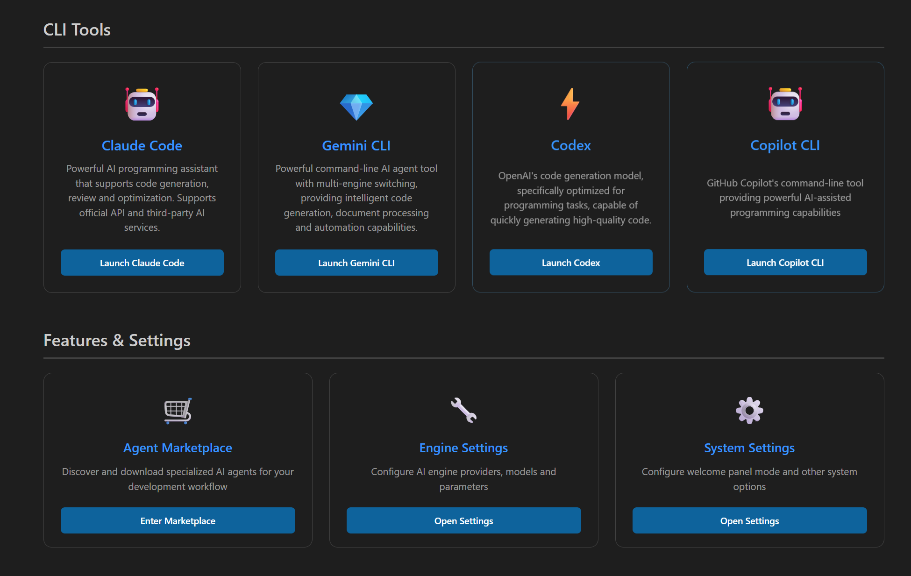
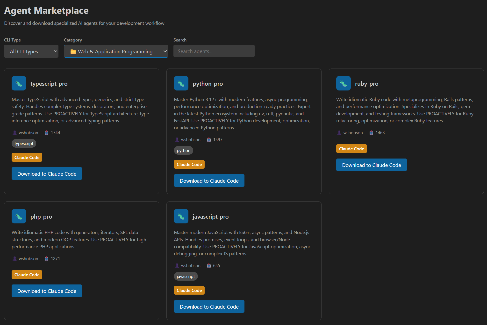
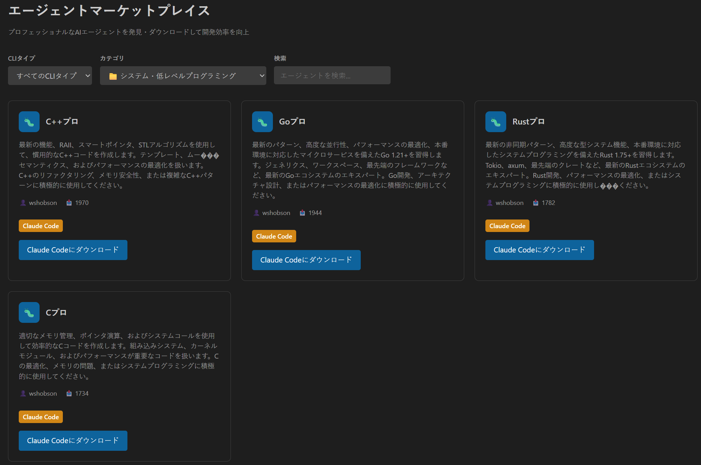
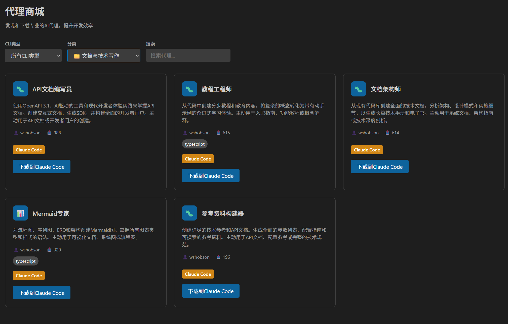

<div align="center">
  <h1>Chameleon 智能助手</h1>
  <p>
    <strong>驾驭顶尖AI，重塑编码与创作流程。您的开源、可扩展的本地AI工作站。</strong>
  </p>
  <p>
    <a href="../README.md">English</a> | <a href="./README.es.md">Español</a> | <a href="./README.ja.md">日本語</a> | <a href="./README.de.md">Deutsch</a> | <a href="./README.fr.md">Français</a> | <a href="./README.zh.md">简体中文</a> | <a href="./README.pt.md">Português</a> | <a href="./README.vi.md">Tiếng Việt</a> | <a href="./README.hi.md">हिन्दी</a> | <a href="./README.ko.md">한국어</a> | <a href="./README.ru.md">Русский</a> | <a href="./README.ar.md">العربية</a>
  </p>
</div>

---

## 🦎 Chameleon 是什么？

Chameleon 不仅仅是又一个AI聊天窗口。它是一款强大的开源VS Code插件，能将您的编辑器转变为一个专业级的**多CLI启动器**和**智能代理商城**。

Chameleon专为开发者、创作者和研究人员设计，通过其**通用多CLI启动器**无缝集成**Claude Code**和**Gemini CLI**，并提供广泛的第三方AI模型支持。它配备了一个包含数百个专业AI代理的**综合代理商城**，让您能够连接任何AI供应商，管理本地与云端模型，并在您最熟悉的VS Code环境中，构建完全属于您自己的、私有的AI工具链。

<div align="center">
  
  <p><em>通用多CLI启动器 - 在Claude Code和Gemini CLI之间无缝切换</em></p>
</div>

## ✨ 核心功能

### 🚀 通用多CLI启动器
* **Claude Code集成**：原生支持Claude Code CLI，包含官方和第三方AI路由
* **Gemini CLI支持**：完整集成Gemini CLI，包括广泛的第三方AI模型兼容性
* **统一界面**：单一控制台无缝管理多个CLI工具和AI供应商

### 🛒 代理商城
* **500+专业代理**：从我们的综合AI代理商城中发现和下载专业代理
* **分类组织**：架构设计、编程语言、基础设施、质量与安全、数据与AI、文档编写和业务分析代理
* **一键安装**：直接下载代理到Claude Code或Codex，支持自动格式转换
* **社区驱动**：持续扩展的社区贡献专业代理集合

<div align="center">
  
  <p><em>代理商城 - 浏览和下载500+专业AI代理</em></p>
</div>

#### 🌍 多语言支持
我们的代理商城支持12种语言的本地化界面：

<div align="center">
  
  <p><em>日文界面 - 为日本开发者提供完整的本地化体验</em></p>
</div>

<div align="center">
  
  <p><em>中文界面 - 原生中文语言支持</em></p>
</div>

### 🎯 高级AI引擎支持
* **6种AI引擎，20+精选模型**：告别供应商锁定！支持OpenRouter、DeepSeek、Google、Volcengine、Azure、Ollama等6种主流AI引擎，涵盖20+个精选模型，包括最新的GPT-4o、Claude 3.5 Sonnet、DeepSeek V3等。
* **第三方模型集成**：通过Claude Code和Gemini CLI广泛支持第三方AI模型
* **智能模型路由**：根据任务复杂度和需求自动选择最佳AI模型

### 🧠 智能模型配置
* **5种专用模型配置**：智能配置短文本、长文本、思考、图像、视频5种专用模型，让每个任务都使用最适合的AI模型。
* **多模态AI支持**：不仅支持文本对话，还支持图像理解、视频分析、OCR识别等多媒体AI能力。
* **智能模型路由**：根据任务复杂度、内容长度、模态类型自动选择最佳模型，在性能与成本间找到完美平衡。

### 💼 专业开发功能
* **专业级笔记本界面**：超越简单的问答。在富文本笔记本中组织AI驱动任务，完美融合Markdown、代码片段和AI指令。
* **智能文档处理**：通过AI驱动的摘要、优化和翻译功能增强您的写作和分析能力。
* **深度IDE集成**：如同VS Code原生功能，通过右键菜单、代码镜头、专属面板随时调用AI工具。
* **隐私优先设计**：支持本地模型运行，让您完全掌控数据安全，同时支持云端API的便利性。
* **完全可定制**：从主题到模型路由规则，您可以定制Chameleon的每个方面以满足您的确切需求。
* **12种语言支持**：完整的中英日德法西葡越印韩俄阿国际化体验。

## 🚀 安装与配置

请根据您的身份选择合适的安装路径：

### 路径一：普通用户（推荐）

按照以下步骤，从VS Code插件市场安装并使用Chameleon。

**第一步：安装多CLI依赖**

Chameleon的通用多CLI启动器依赖于 `Claude Code` 和 `Gemini CLI` 及其路由器。我们提供了便捷的安装向导：
1. 首先，在VS Code中安装本插件（见第二步）。
2. 打开命令面板 (`Ctrl+Shift+P` 或 `Cmd+Shift+P`)。
3. 运行 `Chameleon: 打开安装指南` 命令。
4. 根据指南内的详细步骤，完成Node.js, Git等前置环境的安装。

**第二步：安装插件**

1. 打开 Visual Studio Code。
2. 进入插件市场 (`Ctrl+Shift+X`)。
3. 搜索 **"Chameleon - 智能文档助手"**。
4. 点击"安装"。

**第三步：配置AI供应商**

1. 打开命令面板 (`Ctrl+Shift+P`)。
2. 运行 `Chameleon: 打开AI设置` 命令。
3. 选择您想使用的AI供应商，并填入您的API密钥。
4. 配置完成！点击VS Code活动栏的Chameleon图标，开始使用吧。

### 路径二：开发者（从源代码运行）

如果您希望从源代码运行、修改或贡献代码，请遵循此路径。

**前置条件:**
* 已安装 Git。
* 已安装 Node.js (建议 v16 或更高版本)。
* 已根据**安装指南**，完成 `Claude Code`, `Claude Code Router` 等依赖的安装和配置。

**操作步骤:**

1. **克隆仓库:**
   ```bash
   git clone https://github.com/chameleon-nexus/claude-code-vscode.git
   cd claude-code-vscode
   ```

2. **安装项目依赖:**
   ```bash
   npm install
   ```

3. **编译代码:**
   * 单次编译: `npm run compile`
   * 监视文件变动并自动编译: `npm run watch`

4. **运行插件:**
   * 在VS Code中打开此项目文件夹。
   * 按下 `F5` 键，将会启动一个"扩展开发宿主"新窗口，Chameleon插件将在该窗口中运行。

## 🎯 支持的AI引擎与模型

Chameleon通过Claude Code Router支持**6种主流AI引擎**，涵盖**20+个精选模型**，为您提供专业级的AI选择：

### 🔥 文字AI引擎

#### **OpenRouter**
- **Claude 3.5 Sonnet**: 最强推理能力
- **Claude 3 Haiku**: 快速轻量版本
- **GPT-4o**: 最新多模态模型
- **GPT-4o-mini**: 轻量级版本，性价比极高
- **Llama 3.1 405B**: 开源大模型
- **Gemini Pro 1.5**: 长上下文专家

#### **DeepSeek**
- **DeepSeek Chat**: 通用对话模型
- **DeepSeek Coder**: 专业代码生成

#### **Google Gemini**
- **Gemini Pro**: 通用推理模型
- **Gemini Pro Vision**: 图像理解模型

#### **Volcengine**
- **DeepSeek V3**: 火山引擎版本（128K tokens长上下文）

#### **Azure OpenAI**
- **GPT-4**: 经典高级推理模型
- **GPT-4 Turbo**: 高性能推理模型
- **GPT-3.5 Turbo**: 快速响应模型

#### **Ollama** (本地部署)
- **Llama 3.1**: 开源对话模型
- **CodeLlama**: 代码专用模型
- **Mistral**: 高效推理模型
- **Gemma**: 轻量级模型

### 🎨 多模态AI引擎

#### **图像理解引擎 - Seedream**
- 专业的图像分析、OCR识别、图表理解
- 支持多种图像格式和复杂视觉任务

#### **视频处理引擎 - Seedance**
- 专业的视频内容分析、摘要生成
- 支持长视频理解和动作识别

### ⚙️ 智能模型配置

Chameleon支持**5种专用模型配置**，让您根据不同场景选择最适合的模型：

#### **1. 短文本模型** (快速响应)
- 适用于：简单问答、代码补全、快速翻译
- 推荐：GPT-3.5-turbo, Claude 3 Haiku, DeepSeek Chat

#### **2. 长文本模型** (大上下文)
- 适用于：长文档分析、代码审查、复杂推理
- 推荐：GPT-4o, Claude 3.5 Sonnet, DeepSeek V3

#### **3. 思考模型** (深度推理)
- 适用于：复杂问题解决、架构设计、数学计算
- 推荐：Claude 3.5 Sonnet, GPT-4, Llama 3.1 405B

#### **4. 图像模型** (视觉理解)
- 适用于：图像分析、OCR、图表理解
- 推荐：Seedream引擎

#### **5. 视频模型** (视频处理)
- 适用于：视频摘要、内容分析、动作识别
- 推荐：Seedance引擎

### 🚀 模型路由策略

Chameleon的智能路由系统会根据以下条件自动选择最佳模型：

- **任务复杂度**: 简单任务→快速模型，复杂任务→推理模型
- **内容长度**: 短文本→轻量模型，长文档→大上下文模型
- **模态类型**: 文本→语言模型，图像→Seedream引擎，视频→Seedance引擎
- **用户偏好**: 手动指定特定模型
- **成本优化**: 在性能与成本间找到最佳平衡


## 🚀 安装方法

选择最适合您需求的安装方法：

### 📦 方法一：VS Code商城安装（推荐）

**最简单的安装方式 - 适合大多数用户。**

1. **安装扩展：**
   - 打开Visual Studio Code
   - 进入扩展视图（`Ctrl+Shift+X` 或 `Cmd+Shift+X`）
   - 搜索 **"chameleon-ai-launcher"**
   - 点击"安装"

2. **安装依赖：**
   - 安装完成后，打开命令面板（`Ctrl+Shift+P` 或 `Cmd+Shift+P`）
   - 运行 `Chameleon: Open Installation Guide` 命令
   - 按照分步说明安装Node.js、Git、Claude Code和Gemini CLI

3. **配置和启动：**
   - 运行 `Chameleon: Open AI Settings` 配置您的AI供应商
   - 点击活动栏中的Chameleon图标开始使用！

### 📁 方法二：预构建VSIX包安装

**直接从扩展包文件安装。**

1. **下载VSIX：**
   - 访问 [GitHub Releases](https://github.com/chameleon-nexus/Chameleon/releases)
   - 下载最新的 `chameleon-ai-launcher-x.x.x.vsix` 文件

2. **通过VS Code安装：**
   ```bash
   # 方法A：命令行
   code --install-extension chameleon-ai-launcher-x.x.x.vsix
   
   # 方法B：VS Code界面
   # 1. 打开VS Code
   # 2. 进入扩展视图（Ctrl+Shift+X）
   # 3. 点击"..."菜单 → "从VSIX安装..."
   # 4. 选择下载的.vsix文件
   ```

3. **完成设置：**
   - 按照方法一相同的依赖安装和配置步骤

### 🛠️ 方法三：源代码构建

**适合想要贡献或自定义扩展的开发者。**

**前置要求：**
- Git
- Node.js（v16或更高版本）
- npm或yarn

**步骤：**

1. **克隆和构建：**
   ```bash
   # 克隆代码库
   git clone https://github.com/chameleon-nexus/Chameleon.git
   cd Chameleon
   
   # 安装依赖
   npm install
   
   # 编译扩展
   npm run compile
   
   # 打包扩展（可选）
   npm install -g @vscode/vsce
   vsce package
   ```

2. **开发安装：**
   ```bash
   # 方法A：安装打包版本
   code --install-extension chameleon-ai-launcher-x.x.x.vsix
   
   # 方法B：开发模式运行
   # 在VS Code中打开项目并按F5启动扩展开发主机
   ```

3. **安装依赖：**
   - 按照安装指南说明安装Node.js、Git、Claude Code和Gemini CLI
   - 通过扩展设置配置AI供应商

---

## ⚙️ 安装后设置

**无论使用哪种安装方法，都需要完成以下步骤：**

1. **安装多CLI依赖：**
   - Node.js和npm
   - Git
   - Claude Code CLI（`npm install -g @anthropic-ai/claude-code`）
   - Gemini CLI包

2. **配置AI供应商：**
   - 打开命令面板并运行 `Chameleon: Open AI Settings`
   - 为OpenAI、Anthropic、Google或其他供应商添加API密钥

3. **验证安装：**
   - 点击VS Code活动栏中的Chameleon图标
   - 浏览Claude Code和Gemini CLI页面
   - 检查所有依赖都显示为"已安装"

**需要帮助？** 运行 `Chameleon: Open Installation Guide` 获取详细的分步说明！

## 🌍 国际化

Chameleon支持12种语言：
- English (en)
- 简体中文 (zh)
- 日本語 (ja)
- Deutsch (de)
- Français (fr)
- Español (es)
- Português (pt)
- Tiếng Việt (vi)
- हिन्दी (hi)
- 한국어 (ko)
- Русский (ru)
- العربية (ar)

## 🔧 故障排除

### 常见问题

1. **扩展无法激活**：
   - 检查VS Code开发者控制台（帮助 > 切换开发人员工具）
   - 确认扩展已启用
   - 检查是否有冲突的扩展

2. **AI供应商连接问题**：
   - 验证API密钥配置是否正确
   - 检查网络连接
   - 查看API超时设置
   - 使用内置连接测试功能

3. **安装指南无法工作**：
   - 确保您有管理员权限（Windows）
   - 检查Node.js和Git是否正确安装
   - 尝试按照指南步骤手动安装

### 调试模式

启用调试日志：
1. 打开VS Code设置
2. 搜索"chameleon.debug"
3. 启用调试模式
4. 在输出面板中查看"Chameleon"日志

## 🤝 参与贡献

Chameleon 是一个为社区而生的开源项目。我们欢迎任何形式的贡献！请查阅我们的 [贡献指南](CONTRIBUTING.md) 以了解详情。

### 开发设置

1. Fork 仓库
2. 创建功能分支
3. 进行修改
4. 如适用，添加测试
5. 提交拉取请求

## 📄 开源许可

本项目基于 MIT 许可协议开源 - 详情请见 [LICENSE](LICENSE) 文件。

## 🆘 支持

- **问题反馈**: [GitHub Issues](https://github.com/chameleon-nexus/claude-code-vscode/issues)
- **讨论交流**: [GitHub Discussions](https://github.com/chameleon-nexus/claude-code-vscode/discussions)
- **文档资料**: [Wiki](https://github.com/chameleon-nexus/claude-code-vscode/wiki)

## 📝 更新日志

### v0.1.0 (初始发布)
- 通用AI供应商支持
- 专业级笔记本界面
- 深度IDE集成
- 隐私优先设计
- 完整国际化（12种语言）
- 全面的安装指南

---

**为开发者社区而打造 ❤️**
